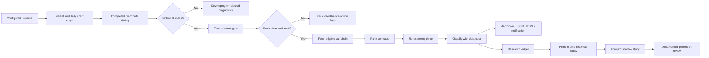

# Bullish Weekly Participation v5 Build And Validation Plan

## 1. Purpose

Bullish Weekly Participation v5 is a read-only research system for fast bullish
continuation setups expressed through short-duration long calls. It combines:

- daily market, trend, leadership, and pattern selection
- completed 60-minute timing
- lane-specific weekly contract research
- strict event and data-trust controls
- a dense operational screener
- a five-script Pine v6 confirmation suite
- point-in-time historical and forward-shadow validation

V5 begins in `research_default`. No score, fixture, replay, Pine backtest, or
historical sample can automatically change that state.

## 2. Objectives

1. Prioritize bullish setups capable of resolving within one to five sessions.
2. Avoid zero through six DTE contracts and their most concentrated expiration risk.
3. Use daily structure for thesis ownership and completed hourly evidence for timing.
4. Fetch expensive option data only after technical and event qualification.
5. Require SIP, OPRA, fresh events, fresh quotes, and stable re-quotes for full trust.
6. Keep tactical and structural management levels semantically separate.
7. Make every rejection diagnosable from reports and the HTML workspace.
8. Keep Python, Pine, configuration, tests, reports, and manuals in parity.
9. Measure actual point-in-time option behavior before considering promotion.
10. Preserve a permanent no-execution boundary.

## 3. Non-Goals

- brokerage account access
- order creation, routing, replacement, cancellation, exercise, or assignment
- universal position sizing
- universal premium stops or profit targets
- probability, certainty, expected-return, or win-rate labels
- same-day or zero-DTE trading
- treating underlying proxy results as option results
- automatically modifying strategy configuration from research output

## 4. System Architecture



## 5. Configuration Contract

The authoritative strategy file is `config/strategy.yaml`. All values flow through
the typed adapter in `scanner/strategy_profile.py`.

Required top-level state:

```yaml
schema_version: 5
profile_name: Bullish Weekly Participation v5
direction: bullish_only
validation_state: research_default
```

Configuration validation must reject:

- a schema other than 5
- a non-bullish direction
- an initial validation state other than `research_default`
- missing Index Weekly or Leader Weekly lanes
- preferred ranges outside hard ranges
- duplicate production/context patterns
- a production/context split other than seven and five

## 6. Lane Specification

### 6.1 Index Weekly

| Field | Value |
|---|---:|
| Symbols | SPY, QQQ |
| Preferred DTE | 10-16 |
| Hard DTE | 7-21 |
| Preferred delta | 0.60-0.75 |
| Hard delta | 0.50-0.85 |
| Intended hold | 1-4 sessions |
| Requalify | 5 DTE |
| No-progress review | 2 sessions |
| Maximum spread | 3% |
| Minimum open interest | 2,000 |
| Minimum volume | 500 |
| Minimum bid size | 10 |
| Minimum ask size | 10 |
| Maximum theta / ask | 5% |

### 6.2 Leader Weekly

| Field | Value |
|---|---:|
| Minimum price | $20 |
| Minimum 20-session average dollar volume | $100 million |
| Preferred DTE | 14-21 |
| Hard DTE | 10-24 |
| Preferred delta | 0.55-0.70 |
| Hard delta | 0.45-0.80 |
| Intended hold | 1-5 sessions |
| Requalify | 7 DTE |
| No-progress review | 2 sessions |
| Maximum spread | 5% |
| Minimum open interest | 1,000 |
| Minimum volume | 200 |
| Minimum bid size | 5 |
| Minimum ask size | 5 |
| Maximum theta / ask | 6% |

### 6.3 Expiration Policy

- Reject 0-6 DTE.
- Prefer a nonstandard weekly expiration.
- Allow a standard monthly expiration only inside the same lane hard window.
- Select the monthly only when its combined open interest, volume, and displayed
  depth are at least 25% stronger than the best weekly.

The short-DTE exclusions are motivated by the non-linear acceleration of time decay
and the concentration of gamma near expiration. See the OIC references for
[Theta](https://prd-web.optionseducation.org/advancedconcepts/theta) and
[Gamma](https://prd-web.optionseducation.org/advancedconcepts/gamma).

## 7. Daily Selection Layer

The daily chart owns:

- price relative to EMA21, SMA50, and SMA200
- long-term trend direction
- weekly alignment
- relative volume
- leadership
- pattern geometry
- trigger
- structural invalidation
- nearest confirmed pivot
- 2R planning objective
- pattern lifecycle

Hard daily protections:

- close above SMA200
- no configured extension violation
- non-hostile market regime
- weekly alignment
- production pattern only
- no failed or stale pattern

Extension must be measured against the configured pattern trigger, not a hidden
moving-average constant.

## 8. Pattern Program

### 8.1 Production Patterns

1. controlled pullback
2. confirmed breakout
3. bull flag
4. breakout retest
5. flat base
6. VCP / tight base
7. ascending triangle

### 8.2 Context-Only Atlas Patterns

1. cup with handle
2. double bottom
3. inverse head and shoulders
4. falling wedge
5. rounding base

### 8.3 Shared Lifecycle

- forming: valid geometry, outside the ready zone
- ready: 0.00-0.30 ATR below the trigger
- confirmed: trigger crossed on a completed bar and no more than 0.75 ATR extended
- stale: confirmed setup older than one daily bar or beyond extension
- failed: close below structural invalidation

Every detector requires:

- positive geometry fixture
- negative geometry fixture
- incomplete-candle test
- shared boundary test
- Python/Pine naming parity
- manual entry

## 9. Completed-Hour Timing

The 60-minute layer uses:

- EMA9
- EMA21
- session VWAP
- RSI
- MACD histogram and direction
- 20-bar relative volume
- higher-low structure
- EMA/VWAP reclaim
- SPY and QQQ hourly confirmation

Entry timing requires:

- completed hourly bar
- daily filter passed
- close above EMA9 and EMA21
- bullish EMA stack
- close above session VWAP
- RSI at or above 50
- positive MACD histogram
- higher-low or reclaim evidence
- market confirmation
- 10:30 AM-2:45 PM ET entry window

The final 3:35 PM ET scan is management-only.

## 10. Event Controls

### 10.1 Leaders

Use the Massive Benzinga earnings endpoint when entitled. Block when earnings fall
inside:

```text
lane maximum hold + 2 trading sessions
```

The adapter records source, checked timestamp, source timestamp, event date, event
status, and summary. Massive documents the partner endpoint at
[GET /benzinga/v1/earnings](https://massive.com/docs/rest/partners/overview).

### 10.2 Indexes

Use:

- [Federal Reserve FOMC calendars](https://www.federalreserve.gov/monetarypolicy/fomccalendars.htm)
- [U.S. BLS release calendar](https://www.bls.gov/schedule/news_release/bls.ics)

Protect:

- FOMC
- Consumer Price Index
- Employment Situation

Block through the first completed post-event hour.

### 10.3 Freshness

- maximum source age: 24 hours
- missing timestamp: fail closed
- stale timestamp: fail closed
- unknown status: fail closed
- source failure: use configured fallback; if not explicitly fresh and clear, reject

Event qualification occurs before option-chain retrieval.

## 11. Data Trust

Full trust requires:

- stock feed exactly `sip`
- option feed exactly `opra`
- primary contract available
- quote age at or below two minutes
- top-contract re-quote stable within 10%
- event status known
- event source timestamp present and fresh

Alpaca describes SIP as consolidated U.S. exchange coverage in
[Historical Stock Data](https://docs.alpaca.markets/us/docs/historical-stock-data-1).
Alpaca distinguishes official OPRA from modified indicative option quotes in
[Historical Option Data](https://docs.alpaca.markets/us/docs/historical-option-data)
and exposes refreshed bid/ask data through
[Latest Option Quotes](https://docs.alpaca.markets/us/reference/optionlatestquotes).

## 12. Contract Ranking

### 12.1 Hard Rejections

- DTE outside lane hard range
- DTE at or below 6
- delta outside lane hard range
- invalid or crossed bid/ask
- spread above lane maximum
- open interest below lane minimum
- volume below lane minimum
- displayed bid or ask size below lane minimum
- quote older than two minutes
- theta unavailable
- theta / ask above lane maximum

### 12.2 Score Components

- preferred delta fit
- preferred DTE fit
- spread
- open interest
- volume
- displayed depth
- theta / ask
- implied versus realized volatility
- extrinsic value percentage
- gamma
- quote age
- quote stability
- expiration preference

Scores rank evidence. They are not a probability.

## 13. Level Semantics

The data model and user interfaces keep these separate:

| Level | Owner | Meaning |
|---|---|---|
| Tactical warning | 60-minute | Momentum deterioration; reassess |
| Tactical failure | 60-minute | Timing thesis failed |
| Structural invalidation | Daily | Underlying setup thesis failed |
| Confirmed pivot | Daily | Nearest verified overhead structure |
| 2R objective | Planning | Synthetic planning reference |

A synthetic objective must never be labeled resistance. The confirmed pivot becomes
the target only when it offers at least 1.5R of room; otherwise the target is the 2R
planning objective with explicit pivot-path review.

## 14. Candidate Classification

### Ready - Verify

All technical, market, event, contract, and trust gates pass, but
`validation_state` remains `research_default`.

### Verify Contract

Technical evidence passes but SIP/OPRA/quote evidence is not fully trustworthy or no
eligible primary contract is available.

### Developing

Bullish structure exists but a non-hard chart threshold remains incomplete.

### Rejected

A hard daily, event, pattern, universe, or contract protection fails.

`Ready` remains unreachable while `validation_state: research_default`.

## 15. Dense HTML Workspace

The HTML output must provide:

- sticky summary and filter controls
- sortable columns
- text search
- state, lane, pattern, DTE, and data-trust filters
- quote age
- theta / ask
- spread, depth, volume, and open interest
- comparison selection for up to three candidates
- contract alternatives
- tactical and structural levels
- event windows and source provenance
- rejection stage and exact reason codes
- responsive desktop, tablet, mobile, and print layouts

Acceptance viewports:

- desktop: 1440 x 1000
- tablet: 1024 x 1366
- mobile: 390 x 844
- print: letter portrait and landscape review

No control, label, table, or detail pane may overlap or clip.

## 16. Pine v6 Suite

### AS_Weekly_Command_1D_v5.pine

- daily trend
- production patterns
- pattern lifecycle
- trigger and structural invalidation
- confirmed pivot and 2R objective
- market and leadership proxies
- `Ready - Verify` research state
- daily alerts

### AS_Weekly_Timing_1H_v5.pine

- EMA9 / EMA21
- session VWAP
- RSI and MACD histogram
- relative volume
- higher-low/reclaim
- intraday market confirmation
- tactical warning and failure
- entry-window and management alerts

### AS_Bullish_Pattern_Atlas_1D_v5.pine

- all twelve patterns
- production/context distinction
- selected trigger/invalidation geometry
- shared lifecycle

### AS_Weekly_Screener_v5.pine

First ten plots:

1. state
2. pattern code
3. trend
4. setup
5. timing
6. market
7. distance ATR
8. daily relative volume
9. extension ATR
10. lane

The script uses no more than five `request.*` calls. TradingView documents both the
five-request limit and first-ten-plot behavior in
[Pine Screener requirements](https://www.tradingview.com/support/solutions/43000742436-tradingview-pine-screener-key-features-and-requirements/).

### AS_Weekly_Underlying_Research_v5.pine

- underlying proxy only
- completed daily bars
- no option-performance claim
- no automatic parameter promotion

## 17. Research Ledger

V5 stores:

- scan profile and validation state
- config hash
- signal and hourly timing timestamps
- lane and pattern
- review state
- trigger
- tactical warning
- tactical failure
- structural invalidation
- confirmed pivot
- 2R objective
- stock, option, and event sources
- event checked and source timestamps
- quote age
- contract DTE and Greeks
- bid, ask, spread, depth, open interest, volume
- theta / ask
- extrinsic value percentage
- expiration style
- re-quote count

Schema upgrades add columns in place and preserve prior rows.

Observation horizons are one through five sessions. Evidence maturity is:

- exploratory: fewer than 50 observations
- provisional: 50-149 observations
- validated: at least 150 observations

Maturity labels describe sample size only. They do not mean profitable or promoted.

## 18. Point-In-Time Historical Study

### 18.1 Entry Alignment

- underlying sequence uses minute bars
- hourly trigger timestamp is authoritative
- entry quote timestamp must be at or after the trigger timestamp
- pre-trigger quotes are never eligible
- stale quotes are rejected
- same-minute trigger and invalidation are treated pessimistically

### 18.2 Fills

- entry near ask
- exit near bid
- per-contract commissions
- no hidden price improvement
- stale exit conditions flagged
- maximum loss displayed as premium plus entry commission

### 18.3 Exits

- event risk
- structural invalidation
- optional planning objective
- DTE requalification boundary
- two-session no-progress review
- lane maximum hold
- end of available data

### 18.4 Walk-Forward Design

- chronological expanding training
- held-out test folds
- purge gap
- embargo gap
- policy chosen only from training data
- overlapping-position-aware count
- maximum concurrent positions
- pattern concentration
- drawdown
- pessimistic fill sensitivity
- neighboring-parameter stability

## 19. Promotion Gates

Historical gates:

- 150 held-out entered contracts per lane
- 40 held-out entered contracts per promoted pattern
- positive median return in at least 60% of folds
- median improvement over frozen longer-DTE baseline
- drawdown above the precommitted floor
- concentration below the precommitted ceiling
- stable neighboring parameters
- resilient pessimistic fills

Forward gates:

- at least 45 calendar days
- at least 50 new eligible shadow opportunities

Decision states:

- `insufficient_evidence`
- `rejected`
- `eligible_for_shadow`
- `eligible_for_promotion_review`

No decision function edits `config/strategy.yaml`.

## 20. Test Matrix

### Configuration

- schema, lanes, ranges, patterns, validation state

### Daily And Pattern

- trend boundaries
- config-driven extension
- confirmed pivot semantics
- seven production patterns
- five context-only exclusions
- completed candles
- lifecycle age and extension

### Hourly

- EMA/VWAP/RSI/MACD/volume structure
- incomplete hour ignored
- 10:30 AM start
- inclusive 2:45 PM cutoff
- 2:46 PM rejection
- management-only final scan

### Event And Trust

- BLS parsing
- FOMC parsing
- active and cleared windows
- earnings blackout
- unknown event
- missing source timestamp
- stale source timestamp
- SIP/OPRA requirements
- stale and unstable option quotes

### Contract

- every DTE boundary
- every delta boundary
- spread boundary
- open-interest boundary
- volume boundary
- depth boundary
- theta / ask boundary
- exact scan-time DTE
- weekly/monthly preference
- top-three re-quote

### Scanner

- no chain fetch for developing charts
- no chain fetch for blocked/stale events
- one chain fetch per finalist
- top-three refresh
- universe price and dollar-volume filters
- no execution endpoints

### Research

- trigger-aligned quotes
- minute rows do not count as sessions
- stale quote rejection
- pessimistic same-minute handling
- commissions
- purge/embargo folds
- overlap metrics
- promotion and shadow gates
- schema migration

### Dashboard

- sorting
- filtering
- comparison limit
- contract alternatives
- diagnostics
- desktop/tablet/mobile/print screenshots

### Pine

- v6 declaration
- parity constants
- completed bars
- confirmed higher-timeframe requests
- seven production / twelve atlas patterns
- first ten Screener plots
- maximum five Screener requests
- explicit proxy label

## 21. Release Sequence

1. Confirm `main` is synchronized and no unrelated changes are overwritten.
2. Run the complete unit suite.
3. Run Ruff.
4. Run mypy.
5. Validate configuration.
6. Run intraday and post-close fixture scans.
7. Run Pine parity.
8. Run the release audit.
9. Generate desktop, tablet, mobile, and print dashboard evidence.
10. Render every DOCX page.
11. Inspect every rendered page for clipping, overlap, orphan headings, and broken
    tables.
12. Sanitize the DOCX for Google Docs.
13. Import as a new native document titled **Ali Swing Suite: Bullish Weekly
    Participation v5 Training Manual**.
14. Export the native document to PDF and inspect every rasterized page.
15. Remove generated state and staging artifacts.
16. Commit directly on `main`.
17. Push `origin/main` without force.
18. Monitor CI.
19. Create and push tag `v5.0.0` only after CI passes.

## 22. Rollback

Rollback uses normal Git history. Do not keep parallel active strategy files or hidden
legacy commands in the working tree. A rollback must be an explicit commit that
restores a complete, internally consistent release.

## 23. Definition Of Done

V5 is complete when:

- only v5 active artifacts remain
- all required checks pass
- all five Pine scripts pass local structural/parity checks
- TradingView compilation and chart review are recorded
- the HTML workspace passes viewport and print review
- the DOCX passes full-page visual review
- the native Google Doc and exported PDF pass visual review
- `validation_state` remains `research_default`
- CI passes on `main`
- the release tag is created only after CI success
