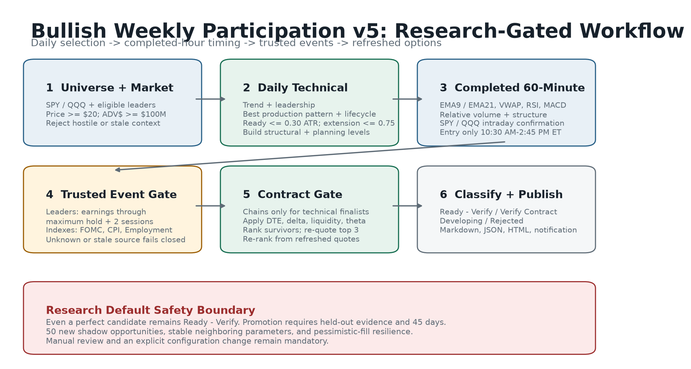
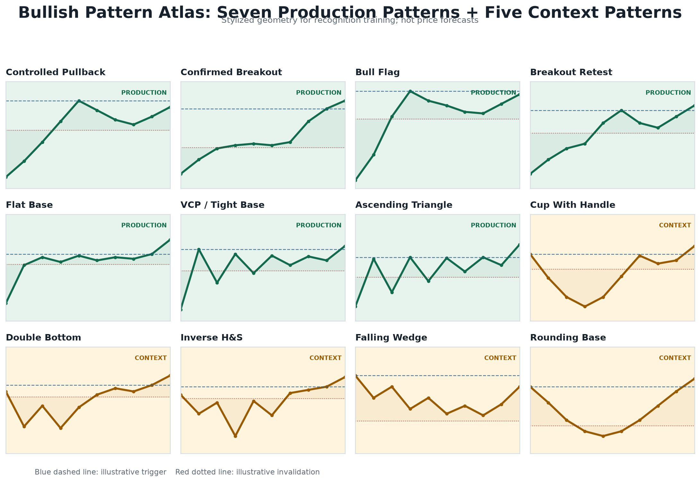
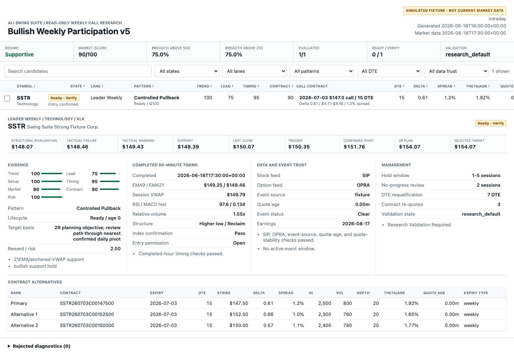

# Ali Swing Suite: Bullish Weekly Participation v5 Training Manual

**System:** SwingSuiteScreener<br>
**Strategy profile:** Bullish Weekly Participation v5<br>
**Validation state:** `research_default`<br>
**Document date:** July 16, 2026<br>
**Scope:** Read-only bullish stock and long-call research

---

## Important Notice

This manual describes a research process. It does not provide investment advice,
personalized suitability analysis, an expected return, a probability of success, or
an instruction to trade.

Long calls can lose the full premium paid. Short-duration options can change value
rapidly because of price movement, time decay, implied volatility, liquidity, and
changes in delta. Before trading exchange-listed options, review the current
[Characteristics and Risks of Standardized Options](https://www.theocc.com/company-information/documents-and-archives/options-disclosure-document).

The software is intentionally read-only. It does not connect to a brokerage account,
inspect positions, place orders, exercise contracts, or manage money.

---

## Quick Reference

### Index Weekly

| Rule | Value |
|---|---:|
| Symbols | SPY, QQQ |
| Preferred DTE | 10-16 |
| Hard DTE | 7-21 |
| Preferred delta | 0.60-0.75 |
| Hard delta | 0.50-0.85 |
| Intended hold | 1-4 sessions |
| Requalify | 5 DTE |
| Maximum spread | 3% |
| Minimum OI / volume | 2,000 / 500 |
| Minimum bid / ask size | 10 / 10 |
| Maximum daily theta / ask | 5% |

### Leader Weekly

| Rule | Value |
|---|---:|
| Minimum price | $20 |
| Minimum 20-session average dollar volume | $100 million |
| Preferred DTE | 14-21 |
| Hard DTE | 10-24 |
| Preferred delta | 0.55-0.70 |
| Hard delta | 0.45-0.80 |
| Intended hold | 1-5 sessions |
| Requalify | 7 DTE |
| Maximum spread | 5% |
| Minimum OI / volume | 1,000 / 200 |
| Minimum bid / ask size | 5 / 5 |
| Maximum daily theta / ask | 6% |

### Entry Timing

- daily thesis qualified
- completed 60-minute bar
- 10:30 AM through 2:45 PM ET
- EMA9 above EMA21
- price above EMA9 and session VWAP
- RSI at or above 50
- MACD histogram positive
- higher low or reclaim
- intraday SPY/QQQ confirmation

### Management

- tactical warning: reassess momentum
- tactical failure: hourly timing failed
- structural invalidation: daily thesis failed
- reassess after two sessions without meaningful progress
- enforce the lane maximum hold
- do not hold through earnings
- exit or fully requalify at the lane DTE boundary

---

## 1. Strategy Doctrine

Bullish Weekly Participation v5 looks for liquid bullish continuation structures
that can reasonably resolve within a short holding window. The strategy is not
designed to predict every market advance. It narrows attention to situations where:

1. the broad market is not hostile
2. the underlying is in a durable daily uptrend
3. a promoted bullish pattern has clear geometry
4. the setup is near its trigger and not extended
5. the completed hourly chart confirms timing
6. event risk is known and acceptable
7. a live call contract passes strict liquidity and decay controls

The strategy prefers evidence agreement over any single indicator. A high score in
one category cannot repair a failed hard protection in another category.

### 1.1 Why Weekly-Duration Calls

"Weekly" means controlled short-duration calls, not same-day or near-expiration
lottery contracts. V5 excludes zero through six DTE.

The Options Industry Council explains that theta is not linear and tends to
accelerate as expiration approaches. It also explains that gamma is generally higher
for near-term, at-the-money options, making delta more sensitive to underlying
movement. See:

- [OIC Theta](https://prd-web.optionseducation.org/advancedconcepts/theta)
- [OIC Gamma](https://prd-web.optionseducation.org/advancedconcepts/gamma)

V5 uses 7-24 DTE hard bounds to retain short-duration responsiveness while avoiding
the most concentrated expiration window.

### 1.2 Research Default

V5 starts in `research_default`.

This means:

- a perfect technical setup does not become `Ready`
- a perfect candidate is labeled `Ready - Verify`
- historical results cannot edit configuration
- shadow evidence cannot edit configuration
- promotion requires a documented manual review

The validation state is a safety control, not a commentary on any individual setup.

### 1.3 Evidence Is Not Probability

Scores answer:

> How much configured evidence does this candidate currently satisfy?

Scores do not answer:

- What is the probability of profit?
- What return should be expected?
- How certain is this trade?
- How much capital should be allocated?

---

## 2. Chart Ownership

### 2.1 Daily Chart

The daily chart owns:

- primary trend
- weekly alignment
- leadership
- production pattern
- trigger
- structural invalidation
- confirmed pivot
- 2R planning objective
- pattern lifecycle

The daily thesis cannot be overridden by an attractive hourly candle.

### 2.2 Completed 60-Minute Chart

The hourly chart owns:

- entry timing
- EMA9 / EMA21 alignment
- session VWAP
- RSI
- MACD histogram
- relative volume
- higher-low / reclaim structure
- intraday index confirmation
- tactical warning
- tactical failure

An incomplete hourly bar does not count.

### 2.3 Market Confirmation

The system evaluates SPY and QQQ on daily and hourly timeframes. The goal is to avoid
isolated bullish signals when the broad environment is hostile or intraday
participation is absent.

---

## 3. Strategy Lanes

## 3.1 Index Weekly Lane

The Index Weekly lane applies only to SPY and QQQ.

Why it differs from individual leaders:

- index options generally have deeper liquidity
- event risk is macro rather than company-specific
- intended holds are shorter
- the preferred delta is higher
- spread and depth requirements are stricter

### Index Contract Rules

- preferred 10-16 DTE
- hard 7-21 DTE
- preferred delta 0.60-0.75
- hard delta 0.50-0.85
- spread no wider than 3%
- open interest at least 2,000
- volume at least 500
- bid and ask size at least 10
- theta / ask no more than 5%

### Index Management Rules

- intended hold: one to four sessions
- no-progress review: two sessions
- exit or fully requalify at 5 DTE
- protect FOMC, CPI, and Employment Situation windows

## 3.2 Leader Weekly Lane

The Leader Weekly lane applies to liquid individual stocks with eligible options.

Universe minimums:

- price at least $20
- 20-session average dollar volume at least $100 million
- options required
- eligible expiration required inside the lane hard window

### Leader Contract Rules

- preferred 14-21 DTE
- hard 10-24 DTE
- preferred delta 0.55-0.70
- hard delta 0.45-0.80
- spread no wider than 5%
- open interest at least 1,000
- volume at least 200
- bid and ask size at least 5
- theta / ask no more than 6%

### Leader Management Rules

- intended hold: one to five sessions
- no-progress review: two sessions
- exit or fully requalify at 7 DTE
- no entry when earnings fall inside maximum hold plus two trading sessions
- no holding through earnings

## 3.3 Weekly Versus Standard Monthly Expiration

The system prefers a nonstandard weekly expiration. A standard monthly can become
primary only when:

1. it falls inside the same hard DTE window
2. it passes every hard contract gate
3. its combined open interest, volume, and displayed depth are materially stronger
4. the liquidity advantage is at least 25%

The label "weekly strategy" describes the duration and workflow. It does not require
selecting a nonstandard expiration when a monthly contract is clearly more liquid.

---

## 4. End-To-End Operating Workflow



### Stage 1: Universe And Market

1. Load configured symbols.
2. Calculate SPY/QQQ market context.
3. Apply leader price and average dollar-volume minimums.
4. Reject stale or incomplete market data.

### Stage 2: Daily Technical Evaluation

1. Calculate trend.
2. Calculate leadership for individual leaders.
3. Detect the best production pattern.
4. Apply lifecycle and extension limits.
5. Build structural levels.

### Stage 3: Hourly Timing

1. Use completed 60-minute candles only.
2. Calculate EMA9, EMA21, session VWAP, RSI, MACD histogram, and relative volume.
3. Evaluate higher-low or reclaim structure.
4. Confirm intraday SPY/QQQ participation.
5. Check the entry window.

### Stage 4: Event Gate

Only technical finalists reach the event adapter.

- leaders: earnings
- indexes: FOMC, CPI, Employment Situation
- unknown, missing, or stale source: fail closed

### Stage 5: Contract Gate

Only event-clear technical finalists receive an option-chain request.

1. Fetch contracts inside the lane DTE window.
2. Reject hard failures.
3. Rank survivors.
4. Re-quote the top three.
5. Re-rank from refreshed quotes.
6. Assess SIP, OPRA, event, quote-age, and quote-stability trust.

### Stage 6: Classification And Output

The candidate becomes:

- Ready - Verify
- Verify Contract
- Developing
- Rejected

The result is written to:

- Markdown
- JSON
- HTML workspace
- notification summary
- research ledger

---

## 5. Daily Trend Qualification

### 5.1 Long-Term Protection

Price must be above SMA200. The long-term trend boundary is a hard protection.

The trend score also considers:

- close above EMA21
- EMA21 above SMA50
- close above SMA50
- SMA50 above SMA200
- rising SMA200
- weekly alignment

### 5.2 Extension

Extension is measured from the selected pattern trigger using ATR.

Maximum confirmed extension:

```text
0.75 ATR
```

Why this matters:

- late entries have less room to the nearest pivot
- the underlying invalidation becomes less efficient
- short-duration calls may be purchased after volatility expands
- theta continues while the setup consolidates

### 5.3 Leadership

Individual leaders are compared with:

- their peer ETF
- SPY
- their own prior performance

Index candidates do not need an individual-stock leadership score.

### 5.4 Controlled Pullback Preference

Controlled pullbacks receive a ranking advantage when other evidence is comparable.
They often offer:

- clearer support
- closer invalidation
- lower extension
- less breakout-volatility inflation

This is a preference, not a guarantee.

---

## 6. Pattern Lifecycle

All patterns share the same states.

### Forming

The geometry exists, but price is not yet inside the ready zone.

### Ready

Price is no more than 0.30 ATR below the trigger.

### Confirmed

Price crossed the trigger on a completed daily bar and:

- the confirmation is no older than one daily bar
- price is no more than 0.75 ATR beyond the trigger

### Stale

The setup is stale when:

- confirmed age exceeds one daily bar
- extension exceeds 0.75 ATR
- price remains above an old trigger without fresh geometry

### Failed

The completed daily close is below structural invalidation.

---

## 7. Production Pattern Playbook



## 7.1 Controlled Pullback

**Purpose:** Join an established uptrend after an orderly retracement.

Required evidence:

- qualified daily uptrend
- pullback into EMA21, anchored value, or confirmed pivot support
- support held
- constructive close
- no excessive extension

Trigger:

- near-term reaction high

Structural invalidation:

- below the defended daily support with ATR allowance

Failure signs:

- close below support
- expanding downside volume
- hourly rally unable to reclaim EMA9/VWAP

Common error:

- treating a steep selloff as a controlled pullback

## 7.2 Confirmed Breakout

**Purpose:** Participate after a completed close through established resistance.

Required evidence:

- qualified daily trend
- close through the prior breakout level
- prior bar at or below the level
- relative volume confirmation
- extension inside the configured maximum

Trigger:

- confirmed breakout level

Structural invalidation:

- breakout level minus ATR allowance or stronger daily support

Failure signs:

- immediate close back below the breakout
- weak hourly reclaim
- low participation

Common error:

- buying an intraday poke before the daily bar completes

## 7.3 Bull Flag

**Purpose:** Participate after a strong impulse followed by a controlled, shallow
consolidation.

Required evidence:

- meaningful flagpole
- retracement roughly 10%-50% of the pole
- contracting or controlled volume
- preserved daily trend

Trigger:

- top of the flag

Structural invalidation:

- flag low

Failure signs:

- retracement becomes too deep
- volume expands on downside bars
- flag loses its descending or sideways containment

Common error:

- calling any short pullback a bull flag without a valid flagpole

## 7.4 Breakout Retest

**Purpose:** Enter after a breakout proves it can hold as support.

Required evidence:

- prior completed breakout
- retest within the allowed age
- low reaches the breakout area without structural failure
- close back above the breakout level

Trigger:

- reclaimed breakout level or reaction high

Structural invalidation:

- retest low

Failure signs:

- close below the prior breakout
- repeated failed reclaims
- increasing downside volume

Common error:

- confusing a failed breakout with a valid retest

## 7.5 Flat Base

**Purpose:** Participate when a strong stock consolidates in a shallow horizontal
range.

Required evidence:

- base depth no greater than configured geometry
- stable upper boundary
- controlled volume
- trend maintained above long-term support

Trigger:

- highest confirmed base resistance

Structural invalidation:

- base low

Failure signs:

- base widens
- lower lows appear
- trend averages roll over

Common error:

- accepting a broad volatile range as a flat base

## 7.6 VCP / Tight Base

**Purpose:** Participate after successive contractions reduce available supply.

Required evidence:

- 60-bar range contracts into 40-bar range
- 40-bar range contracts into 20-bar range
- volume contracts
- daily trend remains qualified

Trigger:

- top of the tightest contraction

Structural invalidation:

- low of the final contraction

Failure signs:

- late range expands
- volume expands without progress
- repeated closes below EMA21

Common error:

- identifying one quiet week as a full volatility contraction pattern

## 7.7 Ascending Triangle

**Purpose:** Participate when repeated tests of resistance are supported by rising
lows.

Required evidence:

- stable upper boundary
- recent swing low above prior swing low
- price inside the ready zone
- trend qualified

Trigger:

- triangle top

Structural invalidation:

- recent rising low

Failure signs:

- rising-low sequence breaks
- resistance becomes unstable or slopes sharply
- price extends before confirmation

Common error:

- drawing a triangle from arbitrary points without repeated resistance tests

---

## 8. Context-Only Pattern Atlas

Context-only patterns are visible for education and research. They cannot qualify a
production entry.

## 8.1 Cup With Handle

Geometry:

- rounded cup
- comparable left and right rims
- controlled handle
- limited handle depth

Research trigger:

- right-rim / handle resistance

Research invalidation:

- handle low

Why context-only:

- longer formation
- more geometric ambiguity
- slower resolution may not fit the weekly holding window

## 8.2 Double Bottom

Geometry:

- two confirmed lows
- acceptable similarity
- adequate spacing
- neckline

Research trigger:

- neckline

Research invalidation:

- lower bottom

Why context-only:

- reversal behavior can conflict with the continuation focus

## 8.3 Inverse Head And Shoulders

Geometry:

- left shoulder
- lower head
- comparable right shoulder
- confirmed neckline

Research trigger:

- neckline

Research invalidation:

- head low

Why context-only:

- subjective neckline and shoulder geometry
- reversal structure may resolve slowly

## 8.4 Falling Wedge

Geometry:

- descending upper and lower boundaries
- upper boundary falls faster
- range contracts

Research trigger:

- upper wedge boundary

Research invalidation:

- recent wedge low

Why context-only:

- regression geometry can be unstable across symbols and time windows

## 8.5 Rounding Base

Geometry:

- gradual left-side decline
- broad bottom
- gradual right-side recovery
- comparable rim area

Research trigger:

- right-rim resistance

Research invalidation:

- base low

Why context-only:

- long duration
- weak fit with fast one-to-five-session resolution

---

## 9. Completed-Hour Timing

## 9.1 EMA9 And EMA21

Preferred structure:

```text
price > EMA9 > EMA21
```

EMA9 provides short-term reaction speed. EMA21 provides the more stable hourly trend
boundary.

## 9.2 Session VWAP

The system calculates VWAP from the latest regular trading session.

Preferred evidence:

- price above VWAP
- reclaim of VWAP after a pullback
- VWAP aligned with EMA support

VWAP is not used as a universal stop.

## 9.3 RSI

V5 looks for constructive, not necessarily extreme, momentum.

- below 50: timing concern
- 50-72: preferred constructive zone
- above the preferred zone: review extension rather than assuming strength

## 9.4 MACD Histogram

Preferred evidence:

- histogram above zero
- histogram stable or rising

A positive histogram is one component. It cannot override failed daily structure.

## 9.5 Relative Volume

Hourly relative volume compares the current completed bar with its recent average.

Volume helps answer:

- Is the move attracting participation?
- Is a reclaim occurring on weak activity?
- Is a failure occurring on expanding activity?

## 9.6 Higher Low Or Reclaim

At least one is required:

- recent low above prior short-term lows
- EMA9 reclaim
- session VWAP reclaim
- price holding above both EMA9 and VWAP after a controlled reaction

## 9.7 Intraday Market Confirmation

SPY and QQQ are evaluated on completed hourly bars. An individual leader should not
receive full timing confirmation when both indexes fail intraday alignment.

## 9.8 Entry Window

New-entry eligibility:

```text
10:30 AM ET through 2:45 PM ET
```

The 2:45 PM boundary is inclusive. At 2:46 PM, timing becomes management-only.

The scheduled 3:35 PM scan exists for:

- warning review
- failure review
- event changes
- DTE review
- next-session preparation

It is not a new-entry scan.

---

## 10. Event Risk

## 10.1 Leader Earnings

Leaders are blocked when earnings occur inside:

```text
maximum intended hold + two trading sessions
```

This protects against:

- gap risk
- implied-volatility repricing
- uncertain announcement timing
- inability to rely on the daily invalidation through a gap

The system uses Massive Benzinga earnings when the entitlement is available. The
endpoint is documented in the
[Massive Partners API](https://massive.com/docs/rest/partners/overview).

No leader position should be held through earnings under this process.

## 10.2 FOMC

Index entries are blocked from the protected morning window through the first fully
completed regular-session hour after the scheduled FOMC statement time. For a 2:00
PM statement, that completed-hour boundary is 3:30 PM ET.

Source:

- [Federal Reserve FOMC calendars](https://www.federalreserve.gov/monetarypolicy/fomccalendars.htm)

## 10.3 CPI And Employment Situation

For premarket releases, entries remain blocked until the first completed regular
session hour.

Source:

- [U.S. BLS release calendar](https://www.bls.gov/schedule/news_release/bls.ics)

## 10.4 Freshness

Event evidence requires:

- known status
- source timestamp
- source age no more than 24 hours

Missing, stale, or future-dated evidence is rejected before option-chain retrieval.

---

## 11. Contract Research

## 11.1 The Live Chain Is Authoritative

The screener proposes a primary contract and up to two alternatives. The current live
chain remains authoritative.

Before any decision, verify:

- expiration
- strike
- DTE
- delta
- bid and ask
- spread
- bid and ask size
- volume
- open interest
- implied volatility
- theta
- gamma
- earnings or macro events

## 11.2 Delta

Delta is used as a responsiveness and moneyness control.

Index preferred range:

```text
0.60-0.75
```

Leader preferred range:

```text
0.55-0.70
```

A higher delta generally makes the contract respond more like the underlying, but it
also changes premium, intrinsic value, and capital at risk. Delta is not a probability
label in this system.

## 11.3 Gamma

Gamma estimates how delta may change for a one-dollar move in the underlying. OIC
notes that gamma tends to be higher near the money and closer to expiration.

V5 records and scores gamma because a short-duration contract can change sensitivity
quickly. Gamma is not used alone to select a contract.

Reference:

- [OIC Gamma](https://prd-web.optionseducation.org/advancedconcepts/gamma)

## 11.4 Theta

Theta estimates daily premium decay with other variables held constant. OIC notes
that time decay is not linear and tends to accelerate as expiration approaches.

V5 calculates:

```text
absolute theta / ask * 100
```

Hard maximum:

- Index Weekly: 5%
- Leader Weekly: 6%

Reference:

- [OIC Theta](https://prd-web.optionseducation.org/advancedconcepts/theta)

## 11.5 Implied Versus Realized Volatility

The screener compares implied volatility with realized volatility.

Purpose:

- identify unusually expensive volatility
- avoid treating elevated option premium as free leverage
- compare contracts consistently

The ratio is a ranking component, not a standalone rejection.

## 11.6 Extrinsic Value Percentage

Extrinsic value is estimated as:

```text
ask - intrinsic value
```

The percentage of ask helps distinguish:

- contracts dominated by time/volatility value
- contracts with more intrinsic participation

## 11.7 Spread

Spread percentage uses the midpoint:

```text
(ask - bid) / midpoint * 100
```

Hard maximum:

- index: 3%
- leader: 5%

A tight quoted spread does not guarantee a fill.

## 11.8 Open Interest, Volume, And Depth

Open interest and volume describe activity. Bid and ask size describe currently
displayed depth.

V5 requires all three because:

- open interest can be high while current trading is inactive
- volume can be high while the current quote is shallow
- displayed size can disappear

## 11.9 Quote Age And Stability

The top three contracts are refreshed before classification.

Requirements:

- quote age at or below two minutes
- refreshed midpoint change no more than 10% for full stability
- OPRA feed for full trust

Alpaca documents official OPRA and indicative data differences in
[Historical Option Data](https://docs.alpaca.markets/us/docs/historical-option-data)
and its
[Latest Option Quotes endpoint](https://docs.alpaca.markets/us/reference/optionlatestquotes).

## 11.10 SIP And OPRA

SIP consolidates activity across U.S. exchanges, while IEX represents a single
exchange. Alpaca documents the distinction in
[Historical Stock Data](https://docs.alpaca.markets/us/docs/historical-stock-data-1).

V5 requires:

- SIP for stock trust
- OPRA for option trust

An indicative option feed can support chart research, but the candidate remains
`Verify Contract`.

---

## 12. Levels And Management

## 12.1 Tactical Warning

Owner:

- hourly chart

Meaning:

- momentum deterioration
- reassess, do not automatically assume structural failure

Typical inputs:

- EMA9
- session VWAP
- recent hourly lows

## 12.2 Tactical Failure

Owner:

- hourly chart

Meaning:

- entry timing thesis failed
- stronger than a warning

Typical inputs:

- EMA21
- recent hourly structure low

## 12.3 Structural Invalidation

Owner:

- daily chart

Meaning:

- the underlying pattern thesis failed

This is the authoritative thesis invalidation.

## 12.4 Nearest Confirmed Pivot

The pivot is a verified daily structure point. It is not synthesized.

Use:

- assess overhead path
- identify congestion
- decide whether the 2R objective has a credible path

## 12.5 2R Planning Objective

The planning objective is:

```text
trigger + 2 * underlying risk
```

It is a planning reference, not guaranteed resistance and not a universal profit
target.

## 12.6 Target Selection

Use the confirmed pivot as the displayed target only when it offers at least 1.5R of
room. Otherwise:

- display the 2R planning objective
- display the confirmed pivot separately
- require path review

## 12.7 No Progress

After two sessions without meaningful progress:

- reassess daily pattern status
- reassess hourly timing
- reassess event calendar
- reassess DTE and theta
- reassess contract spread and depth

No-progress review is not an automatic premium stop.

## 12.8 Maximum Hold

- Index Weekly: four sessions maximum
- Leader Weekly: five sessions maximum

At the boundary, exit or complete a full requalification.

## 12.9 DTE Requalification

- Index Weekly: 5 DTE
- Leader Weekly: 7 DTE

Requalification means repeating:

- daily thesis
- hourly timing
- event check
- current chain
- current Greeks
- current spread/depth
- current quote trust

---

## 13. Review States

## 13.1 Ready - Verify

Meaning:

- technical evidence passed
- event evidence passed
- contract evidence passed
- data trust passed
- research validation gate still applies

Required user action:

- verify the live chart and live contract
- confirm no event update
- confirm the alert occurred on a completed bar

## 13.2 Verify Contract

Meaning:

- chart evidence passed
- contract or feed evidence cannot support a trustworthy selection

Common reasons:

- non-OPRA feed
- no eligible contract
- stale quote
- unstable refreshed quote
- missing depth

## 13.3 Developing

Meaning:

- bullish geometry exists
- one or more non-hard chart gates remain incomplete

Common reasons:

- pattern forming
- timing improving but not confirmed
- score below a review threshold
- outside the new-entry window

## 13.4 Rejected

Meaning:

- hard protection failed

Common reasons:

- below SMA200
- hostile market
- excessive extension
- stale or failed pattern
- event blocked
- event unknown or stale
- universe minimum failed
- contract hard gate failed

---

## 14. Using The HTML Screener



## 14.1 Summary Bar

Review:

- scan type
- validation state
- generated time
- market-data time
- market regime
- breadth
- state counts

If the report is a fixture, it is simulated and not current market data.

## 14.2 Sorting

Click a column header to sort.

Useful first sorts:

- state
- total evidence
- setup
- timing
- contract
- DTE
- quote age
- theta / ask
- spread

## 14.3 Filters

Available filters:

- text search
- state
- lane
- pattern
- DTE range
- data trust

Recommended review sequence:

1. state = Ready - Verify
2. trust = trusted
3. lane
4. pattern
5. DTE
6. quote age

## 14.4 Candidate Comparison

Select up to three candidates.

Compare:

- pattern lifecycle
- distance to trigger
- extension
- timing score
- event window
- contract DTE/delta
- spread
- depth
- theta / ask
- confirmed pivot path

The comparison tool is for evidence review, not position allocation.

## 14.5 Candidate Detail

Each detail pane contains:

- doctrine and state reason
- market and trend evidence
- hourly timing
- event source
- data trust
- primary contract
- alternatives
- tactical and structural levels
- rejection or verification diagnostics

## 14.6 Contract Alternatives

Alternatives are not automatically interchangeable.

Review why the primary ranked first:

- weekly/monthly preference
- DTE
- delta
- spread
- depth
- theta
- volatility
- quote stability

## 14.7 Rejection Diagnostics

Every rejected record includes:

- symbol
- stage
- reason codes
- supporting details

Stages:

- universe or data quality
- technical
- event
- contract

Use reason codes to fix data or understand qualification. Do not weaken a hard gate
just to increase candidate count.

---

## 15. Pine v6 Installation

The TradingView package contains three chart-analysis indicators only. It does not
include a Pine Screener script or a `strategy()` backtest.

## 15.1 Daily Command

File:

```text
AS_Weekly_Command_1D_v5.pine
```

Installation:

1. Open TradingView Pine Editor.
2. Create a new indicator.
3. Replace the editor contents with the script.
4. Save.
5. Add to chart.
6. Set the chart to one day.
7. Confirm the chart contains no labels or historical badges.
8. Review the optional `DAILY QUICK VIEW` table in the top-right corner.
9. Open the Data Window to inspect trend, leadership, setup, market, and pattern
   codes without covering price.
10. Keep `Show current pivot and 2R objective` off unless those planning levels are
   needed for the current review.

Review:

- EMA21, SMA50, SMA200
- short current trigger and structural-invalidation lines
- optional current confirmed pivot and 2R objective
- selected production-pattern code in the Data Window
- market and leadership scores in the Data Window

Quick-view rows:

- State
- Pattern
- Lifecycle and distance from trigger in ATR
- Trend / Setup scores
- Market / Leadership scores
- Trigger
- Structural invalidation
- Next step

Disable the panel with `Settings > Inputs > Show quick insights`.

## 15.2 Hourly Timing

File:

```text
AS_Weekly_Timing_1H_v5.pine
```

Installation:

1. Add the script to the same symbol.
2. Set chart to 60 minutes.
3. Confirm EMA9, EMA21, and VWAP.
4. Confirm the chart contains no labels or historical markers.
5. Review the optional `1H QUICK VIEW` table in the top-right corner.
6. Use the Data Window for timing score, RSI, MACD histogram, relative volume, and
   entry-window state.
7. Confirm entry alerts appear only inside the entry window.
8. Confirm the final scheduled hour is management-only.

The table summarizes state, timing score, daily/market/window gates, RSI and MACD,
relative volume, tactical warning, tactical failure, and the next required action.

## 15.3 Pattern Atlas

File:

```text
AS_Bullish_Pattern_Atlas_1D_v5.pine
```

Use:

- study all twelve patterns
- inspect only the current selected trigger and invalidation
- use Data Window pattern, class, and lifecycle codes instead of chart badges
- enable context-only patterns only for deliberate study; they are off by default
- compare chart geometry with the Python report
- use the optional bottom-right `PATTERN QUICK VIEW` table for selected pattern,
  class, lifecycle, distance, trigger, invalidation, and current insight

The atlas does not promote context patterns.

## 15.4 Indicator-Only Boundary

The active TradingView files are:

1. Daily Command on the one-day chart.
2. Hourly Timing on the 60-minute chart.
3. Pattern Atlas on the one-day chart when deeper pattern study is useful.

Every file uses `indicator()`. None uses `strategy()`, Pine Screener output, custom
labels, shapes, or historical badges. Each indicator has one optional latest-state
table populated only on the chart's last bar. The separate Python/HTML research
screener is not part of the TradingView package.

---

## 16. Alerts

## 16.1 Daily Alerts

Available:

- setup ready for verification
- daily trigger confirmed
- structural invalidation
- extension warning

Alert rule:

- once per bar close

## 16.2 Hourly Alerts

Available:

- completed-hour entry confirmation
- tactical warning
- tactical failure
- management-only window

Alert rule:

- once per bar close

## 16.3 Atlas Alerts

Available:

- production pattern ready
- context-only pattern observed

The context alert is educational and not a production entry alert.

## 16.4 Alert QA

Before relying on an alert:

- confirm chart timeframe
- confirm script version
- confirm once-per-bar-close setting
- confirm symbol
- confirm exchange
- confirm timezone
- compare with Python report
- test on SPY, QQQ, and a representative leader

---

## 17. Worked Research Examples

All examples are hypothetical and do not imply expected results.

## 17.1 Index Controlled Pullback

Situation:

- SPY above rising SMA200
- weekly alignment positive
- pullback holds EMA21
- price 0.18 ATR below trigger
- hourly EMA9 above EMA21
- hourly close above VWAP
- no active CPI, Employment Situation, or FOMC window

Contract research:

- 13 DTE
- 0.67 delta
- 2.2% spread
- OI 8,000
- volume 1,400
- displayed depth 30
- theta / ask 3.8%
- OPRA quote age 0.4 minutes

Classification:

```text
Ready - Verify
```

Why not Ready:

```text
validation_state = research_default
```

## 17.2 Leader Bull Flag

Situation:

- liquid leader above SMA200
- 20-session average dollar volume above minimum
- strong flagpole
- 35% retracement
- declining flag volume
- price 0.22 ATR below flag trigger
- earnings 20 trading sessions away
- hourly reclaim above EMA9 and VWAP

Contract research:

- best weekly: 18 DTE, 0.62 delta
- standard monthly: 16 DTE, similar delta
- monthly liquidity only 10% stronger

Selection:

- weekly remains primary because the monthly advantage is below 25%

## 17.3 Rejected Leader Near Earnings

Situation:

- daily pattern and hourly timing both pass
- earnings in four trading sessions
- lane maximum hold is five sessions
- event buffer is two sessions

Result:

- event blocked
- no option chain fetched
- rejection stage = event

This is intentional. A high-quality chart does not override the event protection.

## 17.4 Verify Contract From Indicative Data

Situation:

- chart and event gates pass
- option feed is indicative

Result:

```text
Verify Contract
```

Required action:

- inspect a current OPRA chain or another trustworthy live source

The indicative quote cannot produce full contract trust.

## 17.5 2R Objective With Pivot In The Path

Situation:

- trigger = 100
- structural invalidation = 97
- 2R objective = 106
- nearest confirmed pivot = 103

The pivot offers only 1R of room, so it is not adopted as the main target. The report
shows:

- confirmed pivot = 103
- 2R planning objective = 106
- target basis = path review through confirmed pivot

The objective is not labeled resistance.

---

## 18. Historical Research Standard

## 18.1 Point-In-Time Requirement

Historical contracts must have existed at the signal date. Historical quotes must be
timestamped.

Entry quote:

```text
quote timestamp >= completed hourly trigger timestamp
```

Pre-trigger quotes are prohibited.

## 18.2 Underlying Sequencing

Use minute-level underlying bars to determine:

- trigger first
- invalidation first
- same-minute ambiguity

Same-minute trigger and invalidation are handled pessimistically.

## 18.3 Fill Model

Default research fill assumptions:

- enter at ask
- exit at bid
- include commission
- reject quote age above two minutes

No unrecorded price improvement is assumed.

## 18.4 Session Counting

Multiple minute quotes on one date count as one trading session for:

- no-progress review
- maximum hold

## 18.5 Walk-Forward Folds

The process:

1. sort experiments chronologically
2. train on past observations only
3. purge observations near the boundary
4. embargo the first test interval
5. choose policy from training data
6. evaluate untouched held-out data

## 18.6 Overlap

Report:

- raw entered count
- non-overlapping adjusted count
- maximum concurrent positions
- largest pattern concentration

This prevents many simultaneous signals from being interpreted as independent
evidence.

## 18.7 Promotion Gates

Required historical evidence:

- 150 held-out contracts per lane
- 40 per promoted pattern
- positive median in at least 60% of folds
- improvement over frozen baseline
- acceptable drawdown
- acceptable concentration
- neighboring-parameter stability
- pessimistic-fill resilience

Required forward evidence:

- 45 calendar days
- 50 new eligible shadow opportunities

Passing creates:

```text
eligible_for_promotion_review
```

It does not change the strategy automatically.

---

## 19. Daily Operating Checklists

## 19.1 Premarket

- [ ] Confirm market calendar and session status
- [ ] Review FOMC, CPI, and Employment Situation schedule
- [ ] Review leader earnings calendar
- [ ] Confirm SIP entitlement
- [ ] Confirm OPRA entitlement
- [ ] Confirm Massive entitlement when used
- [ ] Review prior Ready - Verify candidates
- [ ] Remove candidates with event or structural changes
- [ ] Confirm report timestamps

## 19.2 Daily Chart

- [ ] Close above SMA200
- [ ] Weekly alignment positive
- [ ] Market not hostile
- [ ] Leader universe minimums pass
- [ ] Leadership passes when required
- [ ] Production pattern selected
- [ ] Pattern ready or freshly confirmed
- [ ] Distance no more than 0.30 ATR when ready
- [ ] Extension no more than 0.75 ATR when confirmed
- [ ] Confirmed age no more than one daily bar
- [ ] Structural invalidation visible
- [ ] Confirmed pivot visible
- [ ] 2R objective visible

## 19.3 Hourly Timing

- [ ] Completed 60-minute bar
- [ ] Time between 10:30 AM and 2:45 PM ET
- [ ] Price above EMA9
- [ ] EMA9 above EMA21
- [ ] Price above session VWAP
- [ ] RSI at or above 50
- [ ] MACD histogram positive
- [ ] Relative volume acceptable
- [ ] Higher low or reclaim present
- [ ] SPY/QQQ intraday confirmation
- [ ] Tactical warning visible
- [ ] Tactical failure visible

## 19.4 Event

- [ ] Event status known
- [ ] Source timestamp present
- [ ] Source age no more than 24 hours
- [ ] Leader earnings outside protected horizon
- [ ] Index macro window clear

## 19.5 Contract

- [ ] DTE inside hard range
- [ ] DTE outside 0-6 exclusion
- [ ] Delta inside hard range
- [ ] Spread inside lane maximum
- [ ] OI at or above minimum
- [ ] Volume at or above minimum
- [ ] Bid and ask size at or above minimum
- [ ] Theta / ask inside lane maximum
- [ ] Quote age no more than two minutes
- [ ] OPRA feed
- [ ] Re-quote stable
- [ ] Weekly/monthly preference reviewed
- [ ] Alternatives reviewed

## 19.6 Management

- [ ] Tactical warning status
- [ ] Tactical failure status
- [ ] Structural invalidation status
- [ ] Sessions held
- [ ] Progress after two sessions
- [ ] DTE boundary
- [ ] Earnings or macro update
- [ ] Current spread and depth
- [ ] Full premium loss remains possible

## 19.7 Post Close

- [ ] No incomplete daily bar used
- [ ] Pattern lifecycle updated
- [ ] Stale confirmations removed
- [ ] Structural levels updated
- [ ] Event calendar refreshed
- [ ] Research ledger written
- [ ] Rejection reasons reviewed
- [ ] Next-session watchlist prepared

---

## 20. Troubleshooting

## 20.1 No Candidates

Check:

- market regime
- incomplete candles
- entry window
- leader liquidity minimums
- production pattern list
- event source freshness
- option entitlement

Do not weaken thresholds solely to produce candidates.

## 20.2 Every Leader Is Event-Rejected

Likely causes:

- `MASSIVE_API_KEY` missing
- entitlement unavailable
- configured fallback is unknown
- source timestamp missing
- source older than 24 hours

Expected behavior:

- fail closed
- no chain fetch

## 20.3 Every Contract Is Verify Contract

Check:

- `ALPACA_OPTION_FEED=opra`
- OPRA subscription
- quote timestamps
- future-dated quote rejection
- bid/ask size
- re-quote stability
- spread
- theta availability

## 20.4 Stock Feed Not Trusted

Check:

```text
ALPACA_FEED=sip
```

Alpaca may reject recent SIP requests without the required subscription.

## 20.5 Quote Stale

Check:

- system clock
- provider timestamp parsing
- API response timestamp
- scan delay
- network retries

The maximum is two minutes.

## 20.6 Timing Is Management-Only

Expected causes:

- scan before 10:30 AM ET
- scan after 2:45 PM ET
- post-close or premarket command
- final 3:35 PM scan

## 20.7 Pattern Shows In Atlas But Not Daily Command

The pattern may be context-only:

- cup with handle
- double bottom
- inverse head and shoulders
- falling wedge
- rounding base

This is intentional.

## 20.8 Indicator Shows No Ready State

Check:

- the Daily Command or Pattern Atlas is on a one-day chart
- Hourly Timing is on a 60-minute chart
- the latest candle is completed
- the symbol has enough history
- the Data Window timeframe check equals one
- the setup is not extended or structurally failed

Ready states intentionally wait for completed candles.

## 20.9 Chart Still Looks Busy

Check:

- remove any older copies of the indicators from the chart
- keep optional Daily Command pivot/2R levels off
- keep Pattern Atlas context-only patterns off
- use either Daily Command or Pattern Atlas for routine review, not both at once
- keep the Hourly Timing indicator on a separate 60-minute layout
- turn off `Show quick insights` on any panel that is not needed

## 20.10 Dashboard Layout Problem

Check the generated file in:

```text
reports/intraday/latest.html
```

Review:

- browser zoom at 100%
- desktop, tablet, and mobile widths
- print preview
- long rejection strings
- long contract symbols

## 20.11 Research Sample Says Validated

The maturity label describes sample count only.

It does not mean:

- profitable
- promoted
- production-ready
- suitable for a specific user

Promotion requires every historical and shadow gate.

---

## 21. Technical Commands

### Run Tests

```bash
python -m pytest
```

### Run Ruff

```bash
python -m ruff check scanner tests scripts
```

### Run Mypy

```bash
python -m mypy scanner
```

### Validate Pine Parity

```bash
python scripts/check_pine_parity.py
```

### Run Release Audit

```bash
python scripts/release_audit.py
```

### Run Fixture Intraday Scan

```bash
python -m scanner.run_scan intraday --fixture --scenario ready
```

### Run Fixture Post-Close Scan

```bash
python -m scanner.run_scan post_close --fixture
```

### Open Dashboard

```bash
open reports/intraday/latest.html
```

---

## 22. Glossary

- **ATR:** Average True Range, used to normalize distance and extension.
- **Confirmed pivot:** Verified daily swing high used as real structure.
- **Context-only pattern:** Visible for research but unable to qualify production.
- **Delta:** Estimated option-price sensitivity to a one-unit underlying move.
- **DTE:** Calendar days to expiration.
- **Extrinsic value:** Option premium above intrinsic value.
- **Gamma:** Estimated rate of change of delta.
- **Management-only:** Scan state that cannot authorize a new entry.
- **OPRA:** Consolidated U.S. listed-options quote feed.
- **Production pattern:** Pattern eligible to contribute to candidate qualification.
- **Research default:** Validation state that caps candidates at Ready - Verify.
- **SIP:** Consolidated U.S. equity market feed.
- **Structural invalidation:** Daily level that fails the underlying thesis.
- **Tactical failure:** Hourly level that fails timing without redefining daily geometry.
- **Tactical warning:** Hourly level that calls for reassessment.
- **Theta / ask:** Absolute daily theta divided by current ask.
- **VCP:** Volatility contraction pattern.
- **VWAP:** Volume-weighted average price for the current session.

---

## 23. Official References

Options:

- [OCC Characteristics and Risks of Standardized Options](https://www.theocc.com/company-information/documents-and-archives/options-disclosure-document)
- [OIC Theta](https://prd-web.optionseducation.org/advancedconcepts/theta)
- [OIC Gamma](https://prd-web.optionseducation.org/advancedconcepts/gamma)

Market data:

- [Alpaca Historical Stock Data](https://docs.alpaca.markets/us/docs/historical-stock-data-1)
- [Alpaca Historical Option Data](https://docs.alpaca.markets/us/docs/historical-option-data)
- [Alpaca Latest Option Quotes](https://docs.alpaca.markets/us/reference/optionlatestquotes)
- [Alpaca Option Chain](https://docs.alpaca.markets/us/v1.4.2/reference/optionchain)

Events:

- [Massive Partners API](https://massive.com/docs/rest/partners/overview)
- [Federal Reserve FOMC Calendars](https://www.federalreserve.gov/monetarypolicy/fomccalendars.htm)
- [U.S. BLS Release Calendar](https://www.bls.gov/schedule/news_release/bls.ics)

Pine:

- [TradingView Pine Script User Manual](https://www.tradingview.com/pine-script-docs/)

---

## 24. Final Operating Principle

The purpose of V5 is not to produce more signals. It is to produce a smaller number
of well-documented research candidates whose daily thesis, hourly timing, event
status, contract quality, and data provenance can be inspected independently.

When evidence is incomplete, the correct system behavior is to wait, verify, or
reject.
